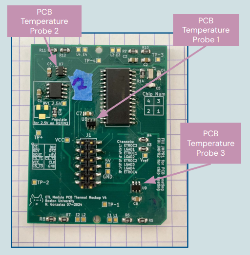

# ETL Thermal Module Mock-up

> *WARNING:* This PCB design and firmware will be depreciated soon. New PCB design will be hosted on [PCB Thermal Mockup](https://gitlab.cern.ch/cms-etl-electronics/) and firmware/software used for readout will be the the latest ETL Test stand [firmware](https://gitlab.cern.ch/cms-etl-electronics/module_test_fw) and [software](https://gitlab.cern.ch/cms-etl-electronics/module_test_sw)

Old Codimd referance: [Documentation](https://codimd.web.cern.ch/QkczGsSpTheHelzOmx9pmw?view)

## Description
The Module PCB Thermal Mock-up is designed with the same physical material as the Module PCB that is expected to be installed on the Endcap Timing Layer on the new MIPs(Minimum ionizing particle) Timing Detector for CMS. The main goal of the Thermal Mockup is for it to be studied under real time operating conditions to monitor the seen temperature of the dummy silicon custom ASIC (ETROC) and dummy silicon sensors (LGAD) in order to predict and verify acceptable performance conditions when placed on the real detector. 

## Hardware
#### Thermal Mockup : TM

#### Main Components
**Dummy ETROC chips:**
The TM contains 4 Dummy ETROC chips that are made from the same material as a real ETROC and are wirebonded to the PCB. However, in this thermal mockup they act as a thermistor in order to monitor the chips expected temperature under operation.

**Dummy LGAD chips:**
The TM contains 4 Dummy LGAD sensors made of silicon which are bumpbonded to the ETROC chips and wirebonded to the PCB. They act like an thermistor in order to monitor temperature under expected operational usage.

**AD77x8:**
The AD7708 and AD7718 are analog to digitial converters (ADCs) with 16 and 24 bits of resoultion respectively. This integrated circuit is used in order to readout the seen voltage drop of the ETROC and LGAD chips. This data is then correlated with seen temperature. It has 8 channels which correspond to the following ETROC & LGAD chips:

| Channel | Chip    |
| ------- | ------- |
| 1       | ETROC 3 |
| 2       | LGAD 1  |
| 3       | ETROC 1 |
| 4       | LGAD 2  |
| 5       | ETROC 2 |
| 6       | LGAD 3  |
| 7       | ETROC 4 |
| 8       | LGAD 4  |

**TMP121:**
There are digital temperature sensors places on the top part of the PCB. There are 3 TMP121s in on the thermal mockup which are used to monitor PCB temperature in different areas.

### Wiring
The Following wiring convetion has been made to make pluging and replugging faster and easier to check:
| Signal | Color  |
| ------ | ------ |
| Clk    | Yellow |
| Dout   | Blue   |
| Din    | Green  |
| Reset  | Orange |
| CS     | White  |
| Ready  | Purple |
| CS_TMP | Brown  |
| 5V     | Red    |
| GND    | Black  |

### PCB Temperature Probe Locations


### Ordering
To order the Thermal Module PCB and SMD Components use 
- Gerbers: TM_gerbers-v4.zip
- Bill of Materials: BOM_TM.csv
```
├── module_pcb_thermal_mockup
│   ├── hardware
│   │   ├── design-files_TM
│   │   └── documents
│   │       ├── BOM_TM.csv
│   │       ├── TM_gerbers-v4.zip
```
*To view PCB and schematic design use KiCad and open `design-files_TM/`, this directory contains all pcb design files*

## Firmware
The Thermal Mockup firmware allows a microcontroller to communicate and operate one Thermal Mockup(TM). [Thermal Mockup Firmware for this design](firmware/)

### Manual
#### Uplaod Firmware onto Microcontroller board
In order to upload the firmware found in the github above the following is required:
- VS Code with the PlatformIO extension downloaded 
- A microcontrolller such as an Arduino Uno or the Adafruit Metro M4 Express

##### Steps:
1. Download the firmware folder
2. Open the appropriate folder 
    - In VS Code select project folder PlatformIO should load up and initialize the project
    - *If it is not the first time uploading the frimware you can also choose the folowing:* 
        - open project in VS Code
        OR
        - cd to project directory on terminal

3. Check the code has no errors by building it 
    - On VS Code -> click on the checkmark button on the bottom of the screen (next to the house icon)
    - On terminal -> type command: `pio run`
        - To build project for a specific microcontroller add the `e` flag 
            - e.g: `pio run -e uno` will build project for an arduino uno
4. Find port the micontroller is connected to and modify **platformio.ini** file as necessary 
    - Before connecting the microcontroller to a computer run a command to see connected usb ports
        - On Mac run `ls /dev/tty.*  `
        - On Linux rn `ls /dev/tty* `
    - Connect microcontroller through a USB port to the computer then rerun the previous command you should see a new entry such as:
        - On Mac e.g: `/dev/tty.usbmodem142201`
        - On Linux e.g: `/dev/ttyUSB0`
    - On in the project directory find file **platformio.ini**, change the env variable `monitor_port` to have 
5. Uplaod code to desired microcontroller
    - On VS Code -> click on the arrow on the bottom of the screen (next to the checkmark)
    - On terminal -> type command: `pio run --target upload` (This will try to upload firmare to all microcontrollers listed in the **platformio.ini** file)
        - To upload project to specific microcontroller use previous command to specify build and then append `-t upload` 
            - e.g: `pio run -e uno -t upload` will upload to an arduino uno

Note: Check out [documents for PlatformIO](https://docs.platformio.org/en/latest/core/quickstart.html) for more specfic building and uploading details 

#### Communication via Serial Monitor
Communicaiton between the microcontroller board and user happens through a serial port and can be viewed on a serial monitor.

### Commands
All commands follow the basic structure of a Linux command:
```bash
command [arguments]
```

The command is the name of the action you desire to run. Arguments are values passed to the action you desire to run. There can be multiple arguments, all seperated by a space. 

>For the remaining part of this section *TMF = Thermal Mockup Firmware*. 

##### Reset:
Cycles reset pin on the AD77x8 on specified TM ADC for 100 microseconds. 
```
reset
```
If arguments are passed they will be ignored (e.g:`reset 10` == `reset` == `reset 1 5 20`).

##### Calibrate:
Calibrates specified ADC channel(s) of the AD77x8 on TM doing the following:
* Writes to the ADC control register to set the channel and its input range 
* Perform zero calibration scaling
* Perform full-scale calibration

```
calibrate [channel(s)]
```

- If no channels are passed then all channels will be cycled. (e.g. `calibrate` will do a full system calibration of all channels)

Multiple channels can be passed as arguments, order will correspond to the sequence the channel is calibrated.

##### Measure:
Read raw ADC data of specificed AD77x8 channel on TM. 

```
status [channel(s)]
```

At least one argument must be passed to specify what channel to measure (e.g: `measure 2`).

##### Status:
Reads and displays the status register of the AD77x8 on TM.

```
status 
```

If arguments are passed they will be ignored (e.g `status` and `status 3 5 7`  will result in the same behavior of reading the status register).

*After reset -> expected value of status: 0*

##### Mode:
Reads or writes the mode register of the AD77x8 on TM.

```
mode <hex>
``` 

- If there is no argument then the mode register is read (e.g. `mode`).
- If an argument is passed then the mode register will be written to. (e.g. `mode 02` writes the value 2 on TM AD77x8 mode register). **When writing to the mode register a subsequent read is automatically performed to display the mode register value that was written.** 
- If more then one argument is passed all arguments after the first will be ignored (e.g. `mode 0a 2B` while result is the same behavior as `mode 0a`).

Lower case or uppercase hex digits are both accepted.

**After reset -> expected value of mode: 0**

##### Control:
Reads or writes the control register of the AD7718 on TM.

```
control <hex>
```

- If there is no argument then the control register is read (e.g. `control`).
- If an argument is passed then the control register will be written to. The argument must be a hex value of size 2 hex characters (e.g. `control 05` writes the value 5 on TM's AD77x8 control register). **When writing to the control register a subsequent read is automatically performed to display the control register value that was written.** 
- If more then one argument is passed all arguments after the first will be ignored (e.g. `control 12 4f 7E` while result is the same behavior as `control 12`).

Lower case or uppercase hex digits are both accepted.

**After reset -> expected value of control: 7**

##### I/O Control:
Reads or writes the I/O control register of the AD77x8 on specific TM.

```
iocontrol <hex>
```

- If there is no argument then the I/O control register is read (e.g. `iocontrol`).
- If an argument is passed then the I/O control register will be written to. The argument must be a hex value of size 2 hex characters (e.g. `iocontrol 12` writes the value 18 on TM's AD77x8 I/O control register). **When writing to the I/O control register a subsequent read is automatically performed to display the I/O control register value that was written.** 
- If more then one argument is passed all arguments after the first will be ignored (e.g. `iocontrol 22 3b cE` while result is the same behavior as `iocontrol 22`).

Lower case or uppercase hex digits are both accepted.

**After reset -> expected value of io_control: 3**

##### Gain:
Reads and displays the value in the gain register of the AD77x8 on specific TM.

```
gain 
```

- If arguments are passed they will be ignored (e.g `gain` and `gain 22 bob 7`  will result in the same behavior of reading the gain register on TM's AD77x8).

**After reset -> expected value of gain(AD7708): 5000ff or gain(AD7718): 500005**

##### Offset:
Reads and displays the value in the offset register of the AD77x8 on specific TM.

```
offset
```

- If arguments are passed they will be ignored (e.g `offset` and `offset 42 3 hi`  will result in the same behavior of reading the offset register on TM's TM's AD77x8).

**After reset -> expected value of offset(AD7708): 8000ff or offset(AD7718): 800000**

##### Filter:
Reads or writes the filter register of the AD77x8 on specific TM.

```
filter -[board(s)] <hex>
```

- If there is no argument then the filter register is read (e.g. `filter`).
- If an argument is passed then the filter register will be written to. The argument must be a hex value of size 2 hex characters (e.g. `filter 08` writes the value 8 on TM's AD77x8 filter register). **When writing to the filter register a subsequent read is automatically performed to display the filter register value that was written.** 
- If more then one argument is passed all arguments after the first will be ignored (e.g. `filter 1c jeje 7` while result is the same behavior as `filter 1c`).

Lower case or uppercase hex digits are both accepted.

**After reset -> expected value of filter: 45**

##### ID:
Reads or writes the ID register of the AD77x8 on specific TM.

```
id <hex>
```

- If there is no argument then the ID register is read (e.g. `id`).
- If an argument is passed then the ID register will be written to. The argument must be a hex value of size 2 hex characters (e.g. `id 03` writes the value 3 on TM's AD77x8 ID register). **When writing to the ID register a subsequent read is automatically performed to display the ID register value that was written.** 
- If more then one argument is passed all arguments after the first will be ignored (e.g. `id 21 boo 3142 489 5` while result is the same behavior as `id 21`).

Lower case or uppercase hex digits are both accepted.

**After reset -> expected value of id(AD7708): 54 or id(AD7718): 43**

##### Probe:
Reads the raw temperature data of the TMP121(s) on specified TM.
```
probe <TMP121 number(s)>
```

- If there is no argument passed an error will occur (Must specify at least one tmp121 e.g. (`probe 2`))
- In order to readout all temperature probes write `probe 1 2 3`

# Old Therrmal Module
*Previous version at nebraska [thermal_mockup_v3](https://tinyurl.com/hdvt5jh5)*


